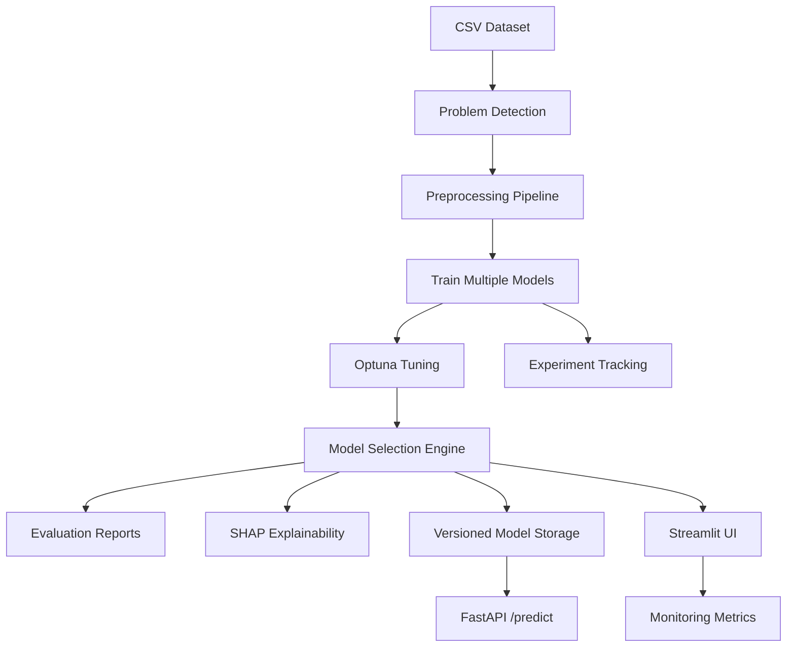

# AutoML Playground

AutoML Playground is a production-style AutoML system for tabular machine learning. It accepts CSV datasets, detects whether the problem is classification or regression, builds a preprocessing pipeline automatically, trains multiple candidate models, tunes top model families, selects the winner with explainable decision logic, generates reports, exposes a Streamlit UI, and includes a FastAPI inference service.

## Project Overview

This project is designed to turn a raw tabular dataset into a complete ML workflow with minimal manual setup.

Core workflow:
- upload a CSV dataset
- choose the target column
- detect the problem type automatically
- preprocess numeric and categorical features
- train multiple models
- tune selected models with Optuna
- select the best model with explainable rules
- generate evaluation artifacts and SHAP explainability
- save versioned models and tracking metadata
- serve predictions through Streamlit or FastAPI

## Features

- Automatic problem detection for classification and regression
- Reusable preprocessing pipeline with:
  - missing-value imputation
  - one-hot encoding
  - numeric feature scaling
- Multi-model training for:
  - classification
  - regression
- Optuna-based hyperparameter tuning for top model families
- Explainable model selection using:
  - score comparison
  - variance penalty
  - simplicity preference when scores are close
- SHAP-based explainability reports
- Versioned model saving with metadata
- Lightweight monitoring and experiment tracking
- Streamlit UI for interactive training
- FastAPI service for inference
- Benchmark runner for comparing performance across datasets
- Docker support for containerized execution
- Pytest test suite

## Architecture Diagram



## Project Structure

```text
automl-playground/
├── api/
│   ├── __init__.py
│   └── main.py
├── app/
│   ├── __init__.py
│   └── streamlit_app.py
├── config/
│   └── dataset_registry.json
├── data/
│   ├── data.csv
│   └── sample_dataset.csv
├── logs/
│   ├── app.log
│   └── metrics.json
├── models/
├── notebooks/
│   └── Untitled5.ipynb
├── reports/
├── src/
│   ├── benchmarking.py
│   ├── data_preprocessing.py
│   ├── evaluation.py
│   ├── experiment_tracking.py
│   ├── explainability.py
│   ├── feature_engineering.py
│   ├── hyperparameter_tuning.py
│   ├── logger.py
│   ├── model_selection.py
│   ├── model_training.py
│   ├── monitoring.py
│   ├── problem_detection.py
│   └── utils.py
├── tests/
├── Dockerfile
├── Procfile
├── README.md
└── requirements.txt
```

## Models Used

### Classification
- LogisticRegression
- RandomForestClassifier
- XGBoostClassifier
- LightGBMClassifier
- SVC
- KNN
- NaiveBayes

### Regression
- LinearRegression
- RandomForestRegressor
- XGBoostRegressor
- LightGBMRegressor
- SVR
- KNNRegressor

## Benchmark Results

Latest benchmark summary from [/Users/basudev/Documents/Auto ML/automl-project/reports/results.csv](/Users/basudev/Documents/Auto%20ML/automl-project/reports/results.csv):

| Dataset | Model | Score |
| --- | --- | ---: |
| Sample Purchase | LogisticRegression | 1.0000 |
| Seattle Housing | XGBoostRegressor | 370574.2323 |
| Iris | KNN | 0.9733 |
| Breast Cancer | LogisticRegression | 0.9737 |
| Diabetes | LinearRegression | 54.8489 |

Benchmark comparison plot:


## Screenshots

Training and explainability artifacts generated by the system:

### Model Comparison


### SHAP Summary


### Feature Importance


## Generated Outputs

The project writes the following outputs during training and benchmarking:

- reports:
  - [/Users/basudev/Documents/Auto ML/automl-project/reports/model_comparison.csv](/Users/basudev/Documents/Auto%20ML/automl-project/reports/model_comparison.csv)
  - [/Users/basudev/Documents/Auto ML/automl-project/reports/model_scores.png](/Users/basudev/Documents/Auto%20ML/automl-project/reports/model_scores.png)
  - [/Users/basudev/Documents/Auto ML/automl-project/reports/residual_plot.png](/Users/basudev/Documents/Auto%20ML/automl-project/reports/residual_plot.png)
  - [/Users/basudev/Documents/Auto ML/automl-project/reports/feature_importance.png](/Users/basudev/Documents/Auto%20ML/automl-project/reports/feature_importance.png)
  - [/Users/basudev/Documents/Auto ML/automl-project/reports/shap_summary.png](/Users/basudev/Documents/Auto%20ML/automl-project/reports/shap_summary.png)
  - [/Users/basudev/Documents/Auto ML/automl-project/reports/results.csv](/Users/basudev/Documents/Auto%20ML/automl-project/reports/results.csv)
  - classification runs also generate `confusion_matrix.png`
- versioned models:
  - saved in [/Users/basudev/Documents/Auto ML/automl-project/models](/Users/basudev/Documents/Auto%20ML/automl-project/models)
- monitoring:
  - [/Users/basudev/Documents/Auto ML/automl-project/logs/app.log](/Users/basudev/Documents/Auto%20ML/automl-project/logs/app.log)
  - [/Users/basudev/Documents/Auto ML/automl-project/logs/metrics.json](/Users/basudev/Documents/Auto%20ML/automl-project/logs/metrics.json)
- experiment tracking:
  - [/Users/basudev/Documents/Auto ML/automl-project/experiments.csv](/Users/basudev/Documents/Auto%20ML/automl-project/experiments.csv)

## Setup Instructions

### 1. Clone and enter the project

```bash
cd "/Users/basudev/Documents/Auto ML/automl-project"
```

### 2. Create a virtual environment

```bash
python3 -m venv .venv
```

### 3. Install dependencies

```bash
.venv/bin/python -m pip install -r requirements.txt
```

## Run the Streamlit App

```bash
cd "/Users/basudev/Documents/Auto ML/automl-project"
.venv/bin/streamlit run app/streamlit_app.py
```

## Run the FastAPI Service

```bash
cd "/Users/basudev/Documents/Auto ML/automl-project"
.venv/bin/uvicorn api.main:app --reload
```

## API Usage

### Health Check

```bash
curl http://127.0.0.1:8000/health
```

Example response:

```json
{
  "status": "ok",
  "model_loaded": true,
  "model_name": "LogisticRegression",
  "problem_type": "classification",
  "target_column": "buy"
}
```

### Prediction

```bash
curl -X POST http://127.0.0.1:8000/predict \
  -H "Content-Type: application/json" \
  -d '{
    "records": [
      {"age": 29, "income": 48000, "experience": 3},
      {"age": 41, "income": 82000, "experience": 12}
    ]
  }'
```

Example response:

```json
{
  "model_name": "LogisticRegression",
  "predictions": ["no", "yes"],
  "model_path": "/path/to/model_YYYYMMDD_HHMMSS.pkl"
}
```

## Run Benchmarks

```bash
cd "/Users/basudev/Documents/Auto ML/automl-project"
MPLBACKEND=Agg .venv/bin/python - <<'PY'
from src.benchmarking import run_all_benchmarks
run_all_benchmarks()
PY
```

## Run Tests

```bash
cd "/Users/basudev/Documents/Auto ML/automl-project"
MPLBACKEND=Agg .venv/bin/python -m pytest tests
```

## Docker

```bash
cd "/Users/basudev/Documents/Auto ML/automl-project"
docker build -t automl-playground .
docker run -p 8501:8501 automl-playground
```

## Tech Stack

- Python
- Streamlit
- FastAPI
- pandas
- numpy
- scikit-learn
- Optuna
- XGBoost
- LightGBM
- SHAP
- Plotly
- Matplotlib
- Seaborn
- joblib
- pytest
- Docker

## Quality Signals

- automated preprocessing
- automatic problem detection
- multi-model benchmarking
- explainable model selection
- Optuna tuning
- SHAP explainability
- versioned model storage
- monitoring and experiment tracking
- API inference layer
- benchmark reporting
- tested backend modules

## Testing Status

Latest local verification:
- `39 passed`

## Resume Summary

Built a production-style AutoML platform in Python with Streamlit and FastAPI that performs automated preprocessing, problem detection, multi-model training, hyperparameter tuning, explainable model selection, SHAP explainability, experiment tracking, monitoring, benchmarking, and API-based inference for tabular ML workflows.
