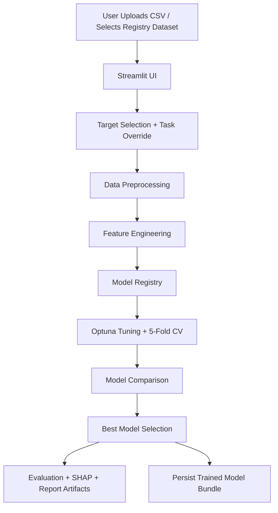

# AutoML Playground

AutoML Playground is a production-style AutoML system for tabular machine learning. It accepts a CSV dataset, profiles the data, preprocesses features, trains and tunes multiple candidate models, selects the best performer automatically, generates evaluation reports, and exposes the workflow through a Streamlit UI.

## Features
- Upload a CSV file or use a registered dataset
- Auto-detect classification vs regression, with manual override
- End-to-end preprocessing with `Pipeline` and `ColumnTransformer`
- Feature engineering with low-variance filtering, `SelectKBest`, and optional polynomial features
- Model training across:
  - `LogisticRegression` / `LinearRegression`
  - `RandomForest`
  - `XGBoost`
  - `LightGBM`
- Optuna-based hyperparameter tuning
- 5-fold cross validation
- Automatic best-model selection
- Report generation in `reports/`
- SHAP-based explainability
- Streamlit UI for interactive training and review
- Saved model bundle for inference and redeployment

## Project Structure
```text
automl-playground/
├── app/
│   ├── __init__.py
│   ├── streamlit_app.py
│   └── streamlit_ui.py
├── config/
│   └── dataset_registry.json
├── data/
│   └── data.csv
├── models/
│   └── .gitkeep
├── notebooks/
│   └── Untitled5.ipynb
├── reports/
│   └── .gitkeep
├── src/
│   ├── __init__.py
│   ├── data_preprocessing.py
│   ├── evaluate.py
│   ├── explainability.py
│   ├── feature_engineering.py
│   ├── hyperparameter_tuning.py
│   ├── model_selection.py
│   └── train.py
├── tests/
│   ├── test_data_preprocessing.py
│   ├── test_feature_engineering.py
│   ├── test_model_selection.py
│   └── test_train.py
├── app.py
├── main.py
├── requirements.txt
└── streamlit_app.py
```

## Architecture


## Core Modules
- [`src/data_preprocessing.py`](/Users/basudev/Documents/Auto%20ML/automl-project/src/data_preprocessing.py)
  handles raw-data preparation, task detection, target encoding, train/test splitting, and preprocessing pipelines.
- [`src/feature_engineering.py`](/Users/basudev/Documents/Auto%20ML/automl-project/src/feature_engineering.py)
  adds low-variance filtering, `SelectKBest`, optional polynomial features, and feature-name tracking.
- [`src/model_selection.py`](/Users/basudev/Documents/Auto%20ML/automl-project/src/model_selection.py)
  defines the production model registry and dataset-driven recommendation rules.
- [`src/hyperparameter_tuning.py`](/Users/basudev/Documents/Auto%20ML/automl-project/src/hyperparameter_tuning.py)
  runs Optuna studies and 5-fold CV for each model family.
- [`src/train.py`](/Users/basudev/Documents/Auto%20ML/automl-project/src/train.py)
  orchestrates the full AutoML workflow and saves the winning model.
- [`src/evaluate.py`](/Users/basudev/Documents/Auto%20ML/automl-project/src/evaluate.py)
  computes metrics and writes report charts such as model comparison and confusion matrix.
- [`src/explainability.py`](/Users/basudev/Documents/Auto%20ML/automl-project/src/explainability.py)
  builds SHAP summaries and exportable explainability plots.
- [`app/streamlit_app.py`](/Users/basudev/Documents/Auto%20ML/automl-project/app/streamlit_app.py)
  is the deployment entrypoint for the Streamlit product experience.

## AutoML Workflow
1. Load dataset from file upload or dataset registry.
2. Choose the target column.
3. Auto-detect or override the task type.
4. Build preprocessing with imputation, scaling, and one-hot encoding.
5. Apply feature engineering.
6. Build the candidate model pool.
7. Tune each candidate with Optuna and 5-fold cross validation.
8. Compare cross-validation performance.
9. Select the best model automatically.
10. Save the model bundle, evaluation artifacts, and charts.
11. Display results in the Streamlit UI.

## Example Outputs
The training pipeline writes artifacts to [`reports/`](/Users/basudev/Documents/Auto%20ML/automl-project/reports):
- `model_comparison.csv`
- `model_comparison.png`
- `confusion_matrix.png` for classification tasks
- `shap_summary.csv`
- `shap_summary.png`
- `training_summary.json`

The trained model bundle is saved at [`models/best_model.pkl`](/Users/basudev/Documents/Auto%20ML/automl-project/models/best_model.pkl).

## Screenshots
Capture screenshots from the deployed or local Streamlit app and place them in the README once you are ready to publish the project externally. Recommended screenshots:
- landing page with dataset upload and configuration controls
- training results with best model summary
- model comparison chart
- SHAP explainability section

## Installation
```bash
cd "/Users/basudev/Documents/Auto ML/automl-project"
python3 -m venv .venv
.venv/bin/python -m pip install -r requirements.txt
```

## Run the App
```bash
cd "/Users/basudev/Documents/Auto ML/automl-project"
.venv/bin/streamlit run app/streamlit_app.py
```

## Run CLI Training
```bash
cd "/Users/basudev/Documents/Auto ML/automl-project"
.venv/bin/python main.py
```

## Run Tests
```bash
cd "/Users/basudev/Documents/Auto ML/automl-project"
MPLBACKEND=Agg .venv/bin/python -m pytest tests
```

## Deployment
The project is deployment-ready for Streamlit-style platforms.

Key requirements:
- complete `requirements.txt`
- Streamlit entrypoint: [`app/streamlit_app.py`](/Users/basudev/Documents/Auto%20ML/automl-project/app/streamlit_app.py)
- saved models excluded from Git and regenerated through the UI when needed

## Tech Stack
- Python
- Streamlit
- pandas
- numpy
- scikit-learn
- Optuna
- XGBoost
- LightGBM
- SHAP
- Plotly
- Matplotlib
- Seaborn
- joblib
- pytest

## Resume-Friendly Summary
Built a production-style AutoML platform in Python and Streamlit that performs automated preprocessing, feature engineering, Optuna-based hyperparameter tuning, cross-validated model selection, SHAP explainability, and report generation for tabular classification and regression datasets.
