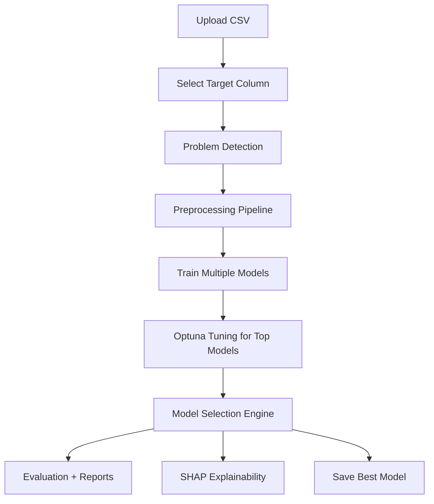

# AutoML Playground

AutoML Playground is a production-style AutoML system for tabular machine learning. It accepts CSV datasets, detects the ML problem type automatically, preprocesses features, trains multiple candidate models, tunes selected models with Optuna, selects the best model using explainable decision rules, generates evaluation reports, and provides a Streamlit UI for interactive use.

## Features
- Upload a CSV dataset through a Streamlit app
- Select the target column dynamically
- Automatically detect:
  - regression problems
  - classification problems
  - numeric features
  - categorical features
- Preprocess tabular data with:
  - numeric imputation
  - categorical imputation
  - one-hot encoding
  - feature scaling
- Train multiple models for classification and regression
- Run Optuna-based hyperparameter tuning for top model families
- Select the best model with:
  - score comparison
  - variance penalty
  - simplicity preference when scores are close
- Generate report artifacts:
  - model comparison table
  - model comparison chart
  - confusion matrix
  - residual plot
  - SHAP feature importance
  - SHAP summary plot
- Save the trained best model for reuse

## Project Structure
```text
automl-playground/
├── app/
│   ├── __init__.py
│   └── streamlit_app.py
├── config/
│   └── dataset_registry.json
├── data/
│   ├── data.csv
│   └── sample_dataset.csv
├── models/
│   ├── .gitkeep
│   └── best_model.pkl
├── notebooks/
│   └── Untitled5.ipynb
├── reports/
├── src/
│   ├── __init__.py
│   ├── data_preprocessing.py
│   ├── feature_engineering.py
│   ├── problem_detection.py
│   ├── model_training.py
│   ├── hyperparameter_tuning.py
│   ├── model_selection.py
│   ├── evaluation.py
│   ├── explainability.py
│   └── utils.py
├── tests/
│   ├── test_data_preprocessing.py
│   ├── test_evaluation.py
│   ├── test_explainability.py
│   ├── test_hyperparameter_tuning.py
│   ├── test_model_selection.py
│   ├── test_model_training.py
│   ├── test_problem_detection.py
│   └── test_project_structure.py
├── Dockerfile
├── Procfile
├── app.py
├── main.py
├── requirements.txt
├── runtime.txt
└── streamlit_app.py
```

## System Architecture


## Models Used
### Classification
- LogisticRegression
- RandomForestClassifier
- XGBoostClassifier
- LightGBMClassifier
- SVC
- KNN
- NaiveBayes

### Regression
- LinearRegression
- RandomForestRegressor
- XGBoostRegressor
- LightGBMRegressor
- SVR
- KNNRegressor

## Explainable Model Selection
The best model is selected using a clear rule-based system:
- highest model score is preferred
- high standard deviation is penalized
- if the score gap is below `1%`, the simpler model is preferred

This produces an explainable reasoning string instead of a black-box winner selection.

## Report Artifacts
Training generates artifacts inside [`reports/`](/Users/basudev/Documents/Auto%20ML/automl-project/reports):
- `model_comparison.csv`
- `model_scores.png`
- `confusion_matrix.png` for classification tasks
- `residual_plot.png` for regression tasks
- `feature_importance.csv`
- `feature_importance.png`
- `shap_summary.png`
- `deployment_summary.json`

The best trained model is saved to [`models/best_model.pkl`](/Users/basudev/Documents/Auto%20ML/automl-project/models/best_model.pkl).

## Installation
```bash
cd "/Users/basudev/Documents/Auto ML/automl-project"
python3 -m venv .venv
.venv/bin/python -m pip install -r requirements.txt
```

## Run the Streamlit App
```bash
cd "/Users/basudev/Documents/Auto ML/automl-project"
.venv/bin/streamlit run app/streamlit_app.py
```

## Run Tests
```bash
cd "/Users/basudev/Documents/Auto ML/automl-project"
MPLBACKEND=Agg .venv/bin/python -m pytest tests
```

## Sample Dataset
A sample dataset is included at [`data/sample_dataset.csv`](/Users/basudev/Documents/Auto%20ML/automl-project/data/sample_dataset.csv) so the project can be tested quickly without needing an external file first.

## Deployment
The project is prepared for deployment with Streamlit and container-based environments.

### Streamlit
```bash
streamlit run app/streamlit_app.py
```

### Docker
```bash
docker build -t automl-playground .
docker run -p 8501:8501 automl-playground
```

## Tech Stack
- Python
- Streamlit
- pandas
- numpy
- scikit-learn
- Optuna
- XGBoost
- LightGBM
- SHAP
- Plotly
- Matplotlib
- Seaborn
- joblib
- pytest

## Testing Status
The project currently includes automated tests for:
- data preprocessing
- problem detection
- model training
- hyperparameter tuning
- model selection
- evaluation/reporting
- explainability
- project structure

Latest local verification:
- `30 passed`

## Resume Summary
Built a production-style AutoML platform in Python and Streamlit that performs automated preprocessing, problem detection, multi-model training, Optuna-based tuning, explainable model selection, SHAP explainability, and report generation for tabular ML workflows.
